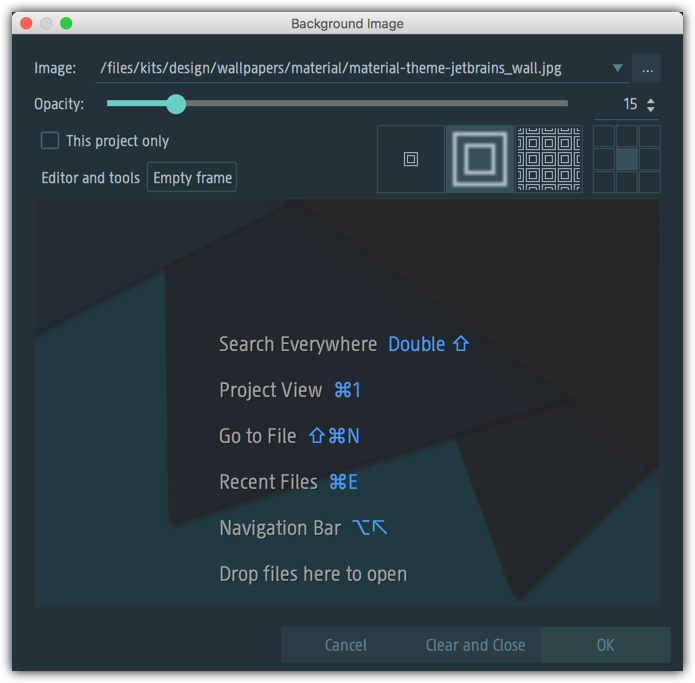

# IntelliJ IDEA notes

These are my notes related to IDEA.

## Material UI theme with background image

This is the setting when using Material UI theme:

[material-theme-jetbrains_wall.png](./images/material-theme-jetbrains_wall.jpg) file is used with opacity 15.

