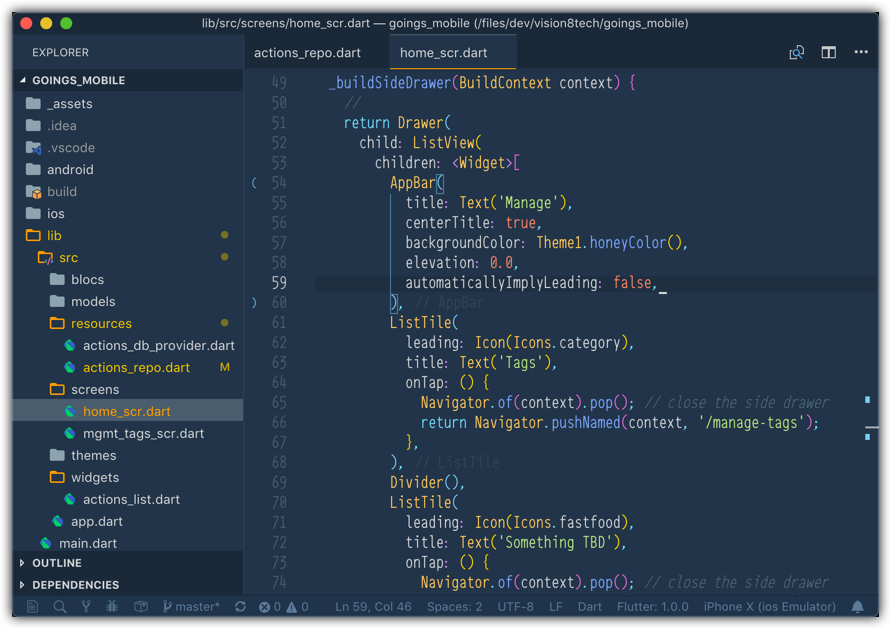

## VSCode Settings

My current settings (`~/Library/Application Support/Code/User/settings.json`) file:

```json
{
    "editor.cursorStyle": "underline",
    "editor.fontFamily": "'64-SRC-Medium'",
    "editor.fontSize": 14,
    "editor.lineHeight": 20,
    "editor.matchBrackets": false,
    "editor.minimap.enabled": false,
    "editor.renderIndentGuides": false,
    "editor.suggestOnTriggerCharacters": false,
    "editor.tabCompletion": "on",
    "editor.wordWrapColumn": 100,
    "keyboard.dispatch": "keyCode",
    "workbench.colorCustomizations": {
        "activityBarBadge.background": "#FFA000",
        "dart.closingLabels": "#324752",
        "statusBar.background": "#223449",
        "statusBar.foreground": "#627a96",
        "statusBar.debuggingBackground": "#223449",
        "statusBar.debuggingForeground": "#627a96",
        "list.activeSelectionForeground": "#FFA000",
        "list.inactiveSelectionForeground": "#FFA000",
        "list.highlightForeground": "#FFA000",
        "scrollbarSlider.activeBackground": "#FFA00050",
        "editorSuggestWidget.highlightForeground": "#FFA000",
        "textLink.foreground": "#FFA000",
        "progressBar.background": "#FFA000",
        "pickerGroup.foreground": "#FFA000",
        "tab.activeBorder": "#FFA000",
        "notificationLink.foreground": "#FFA000",
        "editorWidget.resizeBorder": "#FFA000",
        "editorWidget.border": "#FFA000",
        "settings.modifiedItemIndicator": "#FFA000",
        "settings.headerForeground": "#FFA000",
        "panelTitle.activeBorder": "#FFA000",
        "breadcrumb.activeSelectionForeground": "#FFA000",
        "menu.selectionForeground": "#FFA000",
        "menubar.selectionForeground": "#FFA000"
    },
    "terminal.integrated.cursorStyle": "underline",
    "terminal.integrated.cursorBlinking": true,
    "workbench.colorTheme": "Pines",
    "workbench.statusBar.visible": true,
    "workbench.iconTheme": "eq-material-theme-icons-light",
    "editor.scrollBeyondLastLine": false,
    "editor.smoothScrolling": true,
    "terminal.integrated.fontFamily": "'64-SRC-Medium'",
    "workbench.editor.highlightModifiedTabs": true,
    "workbench.editor.swipeToNavigate": true,
    "window.restoreWindows": "all",
    "window.title": "${activeEditorMedium} ${separator} ${rootName}    (${folderPath})",
    "materialTheme.accent": "Yellow",
    "terminal.integrated.fontWeightBold": "normal",
    "workbench.activityBar.visible": false,
    "activitusbar.inactiveColour": "#546E7A",
    "rewrap.wrappingColumn": 100,
    "window.zoomLevel": 0,
    "todo-tree.defaultHighlight": {
        "foreground": "green",
        "type": "none"
    },
    "todo-tree.customHighlight": {
        "TODO": {},
        "FIXME": {}
    },
    "workbench.fontAliasing": "antialiased",
    "terminal.integrated.rendererType": "dom",
    "http.proxyStrictSSL": false,
    "dart.closingLabels": true,
    "dart.flutterCreateIOSLanguage": "swift",
    "dart.flutterCreateOrganization": "tech.vision8",
    "dart.lineLength": 100,
    "dart.showTodos": false,
    "debug.openDebug": "neverOpen",
    "debug.toolBarLocation": "docked",
    "workbench.statusBar.feedback.visible": false,
    "workbench.editor.tabSizing": "shrink",
    "workbench.editor.showIcons": false,
    "bracket-pair-colorizer-2.rulerPosition": "Left",
    "bracket-pair-colorizer-2.highlightActiveScope": true,
    "bracket-pair-colorizer-2.showHorizontalScopeLine": false,
    "bracket-pair-colorizer-2.showBracketsInGutter": true,
    "bracket-pair-colorizer-2.showBracketsInRuler": true,
    "workbench.startupEditor": "newUntitledFile"
}
```

"and I'm lovin' it!" (like Ludacris saying in "My Chick Bad" :) )


